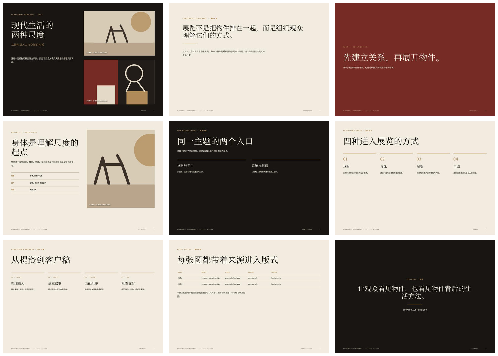

# Slideshow Skill

把策展文案、项目图片和视觉参考整理成一份完整、统一的图文演示文稿。

它不是固定套用某一种内容框架：每个项目先根据文案建立叙事，再从页面组件中选择合适的图文关系。当前主交付是 **PDF**，同时保留结构化 brief 和 HTML 作为可修改的生成源。



## 五分钟开始

### 1. 把仓库地址交给 Codex 安装（推荐）

本仓库已经公开，客户不需要 GitHub 账号。把仓库地址
`https://github.com/ArKurt/slideshow-skill` 发给 Codex，并附上下面这段话：

```text
请安装这个公开 GitHub 仓库中的 slideshow-skill。
skill 路径是 .agents/skills/slideshow-skill。
安装完成后，请告诉我下一条消息怎样开始使用；先不要制作演示文稿。
```

Codex 会从公开仓库直接下载 skill。安装完成后，它会在下一轮消息中可用；如果没有立即出现，请新建一个 Codex 会话或重启 Codex。

也可以下载整个仓库使用：

```bash
git clone https://github.com/ArKurt/slideshow-skill.git
```

用 Codex 打开仓库根目录时，它会自动发现 `.agents/skills/slideshow-skill/`。

### 2. 用最方便的方式提供资料

不要求把文件放进固定的 `inputs/` 文件夹，可以任选或混合使用：

- 直接在对话中粘贴文案；
- 把 Word、PDF、TXT 或图片发送给 Codex；
- 告诉 Codex 单个文件路径；
- 告诉 Codex 一个或多个素材文件夹的位置。

如果习惯按项目整理，也可以使用 `inputs/项目名称/`；这个目录已被 Git 忽略。无论采用哪种方式，都只应提供你有权处理的资料。

建议尽可能提供：

- 客户确认过的文案，推荐 Markdown、Word 导出的文本或 TXT；
- 已筛选的 JPG、PNG、SVG 图片；
- 图片说明、来源和授权备注；
- 可选的视觉参考 PDF 或图片；
- 对页数、语气、受众和交付时间的说明。

### 3. 在 Codex 中发出指令

第一版可以直接使用：

```text
使用 $slideshow-skill。
使用我刚才粘贴、发送或指定路径中的文案和图片，先根据内容设计一份策展演示文稿结构，
再生成统一的 HTML 和 PDF。每页只表达一个主要判断，完成后检查文字溢出、
字体替换、图片裁切和素材来源。如果资料不足，请用普通语言逐步引导我。
完成后告诉我结果保存在哪里，以及最值得优先检查的页面。
```

如果有视觉参考：

```text
使用 $slideshow-skill。
参考我刚才发送或指定的参考文件中的色彩、字体层级、留白和图文关系，
但不要照搬它的内容章节。根据本项目文案重新组织页面。
```

修改时尽量指出页码和保留项：

```text
继续使用 $slideshow-skill 修改第 4 页：保留图片和标题，正文缩短三分之一，
修正右侧文字溢出；其他页面不要改。重新导出 PDF。
```

### 4. 查看结果

你可以指定保存位置；如果是在完整仓库中工作，通常会在 `outputs/项目名称/` 得到：

```text
brief.json       结构化内容与素材记录
deck.html        可在浏览器打开的生成稿
deck.pdf         供客户查看和交付的 PDF
```

`outputs/` 同样不进入 Git。

## 风格如何决定

- **没有提供新的视觉参考**：自动使用当前默认的暖色编辑风格，不需要每次重新发送“虎丘”案例；
- **提供了新的参考**：只提取它的配色、字体角色、留白、图文关系和页面节奏，内容框架仍按本次文案生成；
- **直接描述了艺术方向**：例如“减少酒红”“更克制”“更像学术出版物”，会在默认风格上调整。

默认风格来自虎丘案例的视觉特征，但不包含酒店、投资或建筑项目的叙事框架。

## 运行示例

如果想先确认本机环境，可以让 Codex 执行下面的示例，也可以自己运行。

Windows PowerShell：

```powershell
py .agents/skills/slideshow-skill/scripts/render_deck.py `
  .agents/skills/slideshow-skill/assets/example-brief.json `
  --output outputs/example/deck.html `
  --pdf outputs/example/deck.pdf `
  --preflight
```

macOS / Linux：

```bash
python .agents/skills/slideshow-skill/scripts/render_deck.py \
  .agents/skills/slideshow-skill/assets/example-brief.json \
  --output outputs/example/deck.html \
  --pdf outputs/example/deck.pdf \
  --preflight
```

示例结果也可以直接查看：[example-output.pdf](examples/example-output.pdf)。

## 环境要求

- Codex：用于读取资料、组织内容、编写 brief、调用 skill 和修订页面；
- Python 3.10 或更新版本：HTML renderer 只使用标准库，不需要 `pip install`；
- Edge、Chrome 或 Chromium：只在导出 PDF 和运行边界检查时需要；
- 推荐安装 Noto Serif CJK SC 与 Noto Sans CJK SC；缺少时系统会使用后备字体，版面可能变化。

如果不熟悉命令行，可以直接告诉 Codex：

```text
请先检查运行 slideshow-skill 所需的 Python、浏览器和字体；缺少时告诉我最简单的处理方法，然后运行示例。
```

## 这个 skill 会做什么

- 从文案推导页面顺序，而不是强套固定章节；
- 使用封面、中心宣言、章节页、大图文字页、对照页、卡片网格、时间线、素材清单和结尾页等组件；
- 把本地图片嵌入单文件 HTML，方便传阅；
- 保留图片来源、授权状态和人工审核记录；
- 在浏览器中检查页面边界，再导出 A4 横版 PDF；
- 支持根据新的参考 PDF 调整视觉语言。

## 当前边界

- PDF 是主交付，HTML 和 JSON brief 是生成源；
- 当前版本不生成 PPTX；如确有可编辑办公文稿需求，需要单独验证；
- 不会自动下载远程图片，也不会绕过登录、付费、验证码、DRM 或反爬措施；
- 参考 PDF 只用于提取视觉语言，除非明确要求，不复用其内容框架；
- 图片授权为 `unknown`、`rights_reserved` 或待审核时，不应直接用于外部发布。

## 常见问题

**Codex 没找到 `$slideshow-skill`**

如果是在线安装，安装完成后再发送一条新消息；仍未出现时新建会话或重启 Codex。如果是打开完整仓库，确认打开的是仓库根目录，而不是其中某个文件。

**图片显示为占位框**

检查 `brief.json` 中的图片路径。相对路径以 brief 文件所在目录为基准。

**PDF 文字或边界有问题**

让 Codex 使用 `--preflight` 找出溢出页，并把 PDF 渲染成缩略图进行一次检查—修正—重导。字体不同也会改变换行。

**无法导出 PDF**

先打开生成的 HTML 确认内容；再检查 Edge、Chrome 或 Chromium 是否安装。HTML 生成不依赖浏览器。

## 仓库结构

```text
.agents/skills/slideshow-skill/
├── SKILL.md
├── agents/openai.yaml
├── scripts/render_deck.py
├── references/brief-schema.md
└── assets/
    ├── example-brief.json
    └── example-scene-*.svg

examples/     可公开示例
inputs/       本地项目提资，不进 Git
outputs/      本地生成物，不进 Git
```

这个仓库仍处于客户试用阶段。最有价值的反馈是：输入资料通常长什么样、哪类页面最常修改、PDF 是否满足沟通习惯，以及是否确实需要 PPTX。
